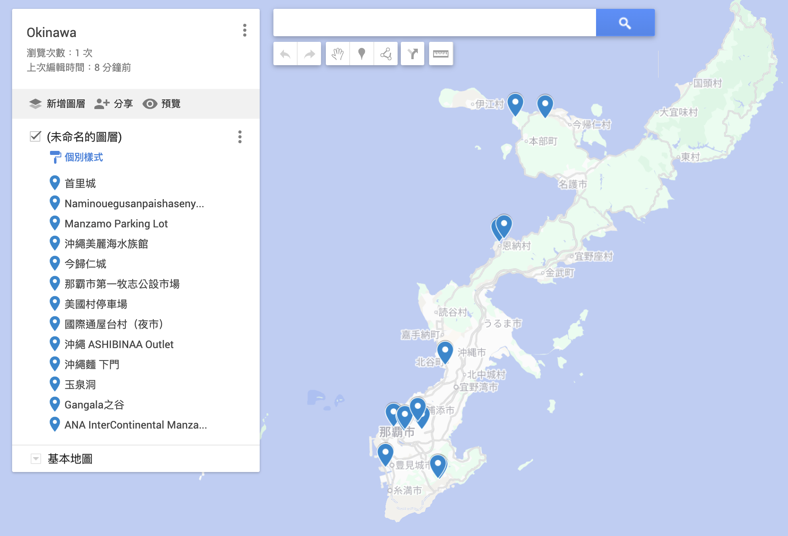

# Okinawa 2026

> 2/13 - 2/18 （六天五夜）

## 行程安排
### Day 1
抵達那霸機場後租車，往 ANA InterContinental Manza Beach Resort 開，途中可在美國村休息、吃午餐。下午入住飯店，到傍晚都留在飯店和[萬座毛](#萬座毛)一帶慢慢玩。

### Day 2: 

早上從飯店出發開車約 1.5 小時到[沖繩美麗海水族館](#美麗海水族館)，建議一早入館，預留 3–4 小時慢慢逛。
（午餐待定）。
下午先往北開去[今歸仁城遺跡](#今歸仁城跡)，再往南去本部町吃晚餐，晚上開車回飯店休息。

### Day 3

上午可往北到名護市區，享受海景、公路兜風和咖啡廳。（名護海港吃海鮮？）

下午回飯店享受設施，晚上在飯店或恩納路邊餐廳（待定）用餐，作為度假區最後一晚。

### Day 4
退房後自在地往南開，恩納到那霸市區大約 1 小時多一點，建議中午前後抵達那霸。
午餐去首里附近吃[Shimujo沖繩麵](#沖繩麵)。(逛附近神社？)
下午先去[首里城](#首里城)散步，再進市區飯店 Check-in，傍晚去[波上宮](#波上宮)＋波之上海灘，晚上專心逛[國際通](#國際通)和周邊商店街。

### Day 5

一早直接去[Ashibinaa Outlet](#ashibinaa-outlet)血拼。下午去[玉泉洞](#玉泉洞)、[Gangala山谷](#gangala-山谷)看鐘乳石景觀、喝咖啡。

### Day 6
吃完早餐去機場還車，返程。

## 景點介紹
北部
### [美麗海水族館](https://maps.app.goo.gl/TbQ8toqbRponY2oHA)

「沖繩美麗海水族館」是沖繩最具代表性的觀光景點之一。遊客不僅能與鯨鯊和珊瑚礁鬼蝠魟等明星動物相遇，它還肩負著保育瀕危物種、研究深海生物等責任，旨在將沖繩的海洋延續至未來。水族館位於海洋博公園內，是能同時體驗自然與文化的重點區域。造訪沖繩美麗海水族館，你將能接觸到沖繩海洋的富饒，以及守護其未來所做的努力。

### [今歸仁城跡](https://maps.app.goo.gl/3g53e5GdP2tKxrtt8)

今歸仁城跡是知名的歷史景點，於2000年被列入世界文化遺產，至今仍有許多未解之謎，充滿神秘色彩。今歸仁城展現了琉球王國獨特的建築工藝，城牆採用「野面積み」（nozura-zumi）砌石工法，以天然石材疊砌而成，最高處達8公尺。整座城郭依山勢而建，巧妙利用自然地形，城牆走向彎曲富有韻律感。主要建築包含城門、主殿遺跡和祭祀場所等，在險要的地形上構築出堅固的防禦工事，充分展現了當時的軍事防禦思維與建築技術的精湛。

---
中部
### [萬座毛](https://maps.app.goo.gl/xoETQvhQ6TsdZkAb9)

沖繩萬座毛，佇立在海上的象鼻岩，是沖繩指標性景點之一。萬座毛Map Code、萬座毛美食、最佳拍攝時間，參觀重點都整理好囉～萬座毛停車交通都很方便，很適合和萬座毛附近景點，如海中公園、琉球村等一起攻略。

一般人在萬座毛停留時間不長，30分鐘就很夠了，「毛」在沖繩方言中有草原之意，因古代琉球國王造訪時，讚嘆這裡是「萬人可乘坐的毛」因此得名。

---
南部
### [波上宮](https://maps.app.goo.gl/66PihE2bmNy2LDD28)
身為琉球八社之首的波上宮，在琉球王國時期被尊稱為「當國第一神社」，是當地人的信仰聖地；也是八社中唯一靠海的神社，與那霸港往來的船隻相對望，許多漁民都會在此祈求一帆風順、滿載而歸。

離開前別忘了到神社旁的授予所 (御守、神符販賣部) 逛逛，這裡只營業到17:00，想購買御守的話可別太晚來喔！

開車就方便啦，有「免費」波上宮停車位給參拜民眾，但僅限停30分鐘，對想參拜又想拍照的人恐怕不太夠用，建議停外面停車場才不會太趕。波上宮周邊車位很搶手，可以到若狹海濱停車場 or 波之上立體駐車場，車位較多喔。

### [首里城](https://maps.app.goo.gl/yxWaxpf6yn7mw9Ny7)

位於沖繩縣那霸市的「首里城」。沖繩紀念公園的一部分為「首里城公園」，園內散佈著以「首里城正殿」為首的多座具有高度歷史價值的建築物。這裡也是被列入世界遺產的沖繩代表性觀光景點。

象徵沖繩歷史與文化的首里城，曾是琉球王國的政治、外交與文化中心，也是琉球國王居住的王宮。
琉球王國自1429年至1879年，存續了450年之久，直到1879年春天成為「沖繩縣」之前，一直是一個獨立於日本的國家。由於不僅與日本，還與中國及東南亞進行頻繁貿易，因此孕育出琉球獨特的文化。這份獨特的文化在「首里城正殿」中得到充分體現，其鮮艷的朱紅色城牆和瓦屋頂的設計，是中國與日本築城文化完美融合的結晶。

首里城正殿歷經多次焚毀和重建，其中部分建築至今仍得以保存，並以「首里城正殿遺構」之名列入世界文化遺產名錄。然而在2019年10月31日的火災中，「首里城正殿」再度遭到燒毀，另有七棟建築同時受損。目前在來自日本國內外的援助資金協助下，正在進行復原與重建工程，目標於2026年完成重建。

### [那霸市第一牧志公設市場（可選）](https://maps.app.goo.gl/rmKuMFHN5Ja2Ns3F6)
- 和牛專門店（代客料理）
- 沙翁
- 花生豆腐

### [美國村](https://maps.app.goo.gl/97GV1GS12kpbbgnB9)
沖繩中部美國村的「Depot Island」在逐年擴展下，集結7棟獨樹一格，130多間不同主題的度假飯店及商業店舖，加上精心規劃的街區、裝置藝術，散發出濃厚的美國小鎮氛圍。白天色彩繽紛、夜晚璀璨浪漫，自成一派的悠閒風情，入住在此，不用舟車勞頓，吃喝玩樂全在步行之距。租個自行車便可來到鄰近的宮城海岸及安良波海灘公園，絕美的海域及各式海上活動，不止適合喜歡戶外運動的人，找間海景餐廳或咖啡館飽餐一頓，讓腦袋放空，身心放鬆。

### [國際通](https://maps.app.goo.gl/dkGNB9rHnBv4kwPh7)

位於那霸市中心，​國際通是那霸市最繁華的商店街

### [Ashibinaa Outlet](https://maps.app.goo.gl/MrZ7Au6UqNBy46gv7)
「Ashibinaa」在沖繩方言中有著遊樂場的意思，象徵這裡是一個讓各種人群與文化聚集、享受購物與休閒樂趣的場所。Ashibinaa Outlet是沖繩唯一的Outlet購物中心，距離那霸機場僅15至20分鐘車程，適合當作抵達或離開沖繩時的首選購物站。這裡擁有超過100家品牌專門店，半開放式空間即使下雨也能舒適逛街，園區內設有免費大型停車場、嬰兒車與輪椅租借、置物櫃與行李寄存服務，親子與長輩同行也很方便。

### [沖繩麵](https://maps.app.goo.gl/NKztWsFTPa47J9cr8)

沖縄そばの店しむじょう(shimujo)是間戰後立即被修復、屋齡約65年的沖繩老宅，藏身住宅區的小路中，木造紅瓦房的建築物被國家註冊為「有形文化財產」，是一間滿滿日本人，幾乎看不見外國觀光客的沖繩麵(沖繩そば)店。

しむじょう位於單軌市立病院前站，步行約8-10分鐘，得爬坡前來的半山腰處，附近景點為琉球八社之一的「末吉宮」，我們當初就是要來末吉宮才會發現這間隱密的沖繩麵麵店。

### [玉泉洞](https://maps.app.goo.gl/tzNEoFTeYccY5n9z5)

玉泉洞位於沖繩縣南部的南城市，是日本國內鐘乳石數量最多的鐘乳石洞。
玉泉洞是著名的文化主題公園「沖繩世界文化王國」中的一個景點，過去被稱作「ウワーガーガマ（uwa-ga-gama）」。在很長一段時間，這個鐘乳石洞都處於未開發的狀態，直到1967年因相關學術機構調查，玉泉洞才初次展現出全貌。這裡有超過100萬塊鐘乳石，在日本國內堪稱最多。目前，全長5公里的玉泉洞僅向人們開放890公尺，剩下的區域被保護起來作為科學調研使用。
玉泉洞的看點當然就是經歷了30萬年歲月雕琢才形成的鐘乳石，其中最有名的是石柱林立的「升龍之鐘」，它被譽為東洋第一美，被指定為天然紀念物。另外，洞內後半部分的梯田空間里，積蓄著透明度極高的水泉——「青泉」，在彩燈的照耀下這裡散髮著神秘美感。這附近還有同為鐘乳石洞的「[Gangala山谷](#gangala-山谷)」，推薦您有時間也可以去看看。

### [Gangala 山谷](https://maps.app.goo.gl/1N31vSdDoxsPCybs9)

## 相對地理位置

[查看完整地圖](https://www.google.com/maps/d/edit?mid=1sl8JxFVxS8VFNEJS1l5s2SlzJPCoWwQ&usp=sharing)

